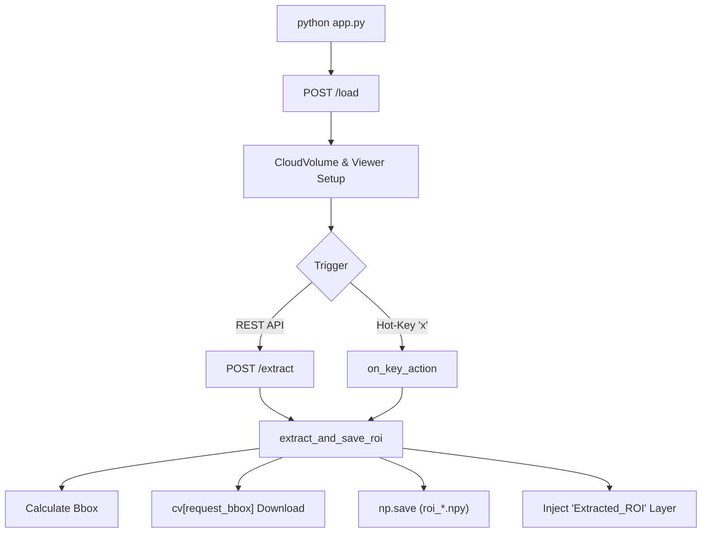

# Neuroglancer ROI Extractor

A robust API and visualization toolset for extracting 3D volumetric Regions of Interest (ROIs) from large-scale neuroimaging datasets. This project integrates **FastAPI**, **Neuroglancer**, and **CloudVolume** to provide a seamless workflow from dataset navigation to local data extraction and inspection.

---

## Purpose & Overview

The primary goal of this tool is to simplify the process of "snipping" small volumetric cubes (default 40x40x40 voxels) from massive remote datasets (Zarr, Precomputed, Boss) for local analysis, machine learning training, or detailed inspection.

### Key Features:
*   **Interactive Extraction:** Navigate the dataset in your browser and press the `x` key to instantly save a 3D cube centered at your mouse cursor.
*   **REST API Control:** Programmatically trigger extractions via POST requests.
*   **Live Preview:** Extracted ROIs are automatically injected back into the Neuroglancer viewer as a separate high-resolution layer.
*   **Offline Inspection:** A dedicated Jupyter notebook viewer for slice-by-slice analysis of saved `.npy` files.

---

## Process Workflow



---

## File Explanations

| File | Description |
| :--- | :--- |
| `app.py` | The core FastAPI server. It manages the Neuroglancer session, handles dataset loading, and executes the extraction logic. |
| `viewer.ipynb` | An interactive Jupyter notebook using `matplotlib` and `ipywidgets` to view the saved `.npy` files slice-by-slice. |
| `roi_X_Y_Z.npy` | 3D NumPy arrays containing the extracted volumetric data. The filename indicates the center voxel coordinates. |
| `extracted/` | Default output directory for all saved ROI files. |

---

## Installation

Ensure you have Python 3.14+ installed. It is recommended to use a virtual environment.

```powershell
python -m venv venv
.\venv\Scripts\activate
pip install fastapi uvicorn pydantic cloud-volume neuroglancer numpy zarr fsspec s3fs
```

*Note: On Windows without C++ Build Tools, `DracoPy` and `pysimdjson` are shimmed to allow basic functionality.*

---

## Getting Started

### 1. Start the API Server
Run the server to initialize the Neuroglancer viewer and the REST endpoints.

```powershell
python app.py --api-port 8000 --ng-port 5000 --out-dir ./extracted
```

### 2. Load a Dataset
Use PowerShell `Invoke-RestMethod` to connect the tool to a remote volumetric dataset.

**Google Public Data:**
```powershell
Invoke-RestMethod -Uri "http://localhost:8000/load" -Method Post -ContentType "application/json" -Body '{"url": "https://storage.googleapis.com/neuroglancer-public-data/flyem_fib-25/image"}'
```

**Local/Remote Zarr:**
```powershell
Invoke-RestMethod -Uri "http://localhost:8000/load" -Method Post -ContentType "application/json" -Body '{"url": "http://172.20.23.241:10229/421.zarr/s4/"}'
```

### 3. Extract an ROI
You can trigger an extraction programmatically via PowerShell:

```powershell
Invoke-RestMethod -Uri "http://localhost:8000/extract" -Method Post -ContentType "application/json" -Body '{"x": 1000, "y": 2000, "z": 3000}'
```

Or simply hover in the Neuroglancer window and press **`X`**.

---

## Visualizing Results

After extracting several ROIs, use the provided notebook to inspect them:

1.  Open `viewer.ipynb` in VS Code or Jupyter Lab.
2.  Update the `roi_path` variable in the second cell to point to one of your saved `.npy` files.
3.  Run the cells to use the **Z-Slice Slider** for interactive navigation.

---

## Configuration
*   **API Port:** `--api-port 8000`
*   **Neuroglancer Port:** `--ng-port 5000`
*   **Target Token:** The viewer uses a persistent token (you can change this) (`b8966e6d2e89245f71543638d237d5eceda58550`) for a uniform UI.
*   **CUBE_RADIUS:** Set to `20` in `app.py` (results in a 40px cube). Increase this for larger extractions.

---

## Developer

**Tahmeed Ahmad**  
GitHub: [@syedtahmeed12](https://github.com/syedtahmeed12)
